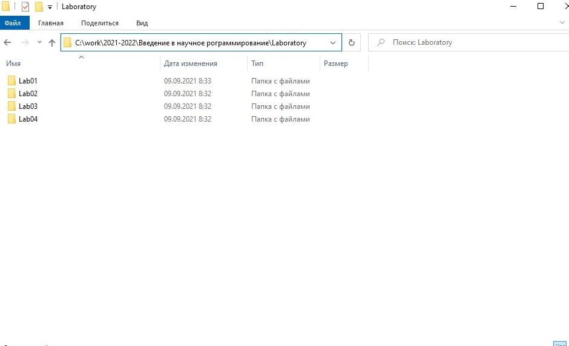
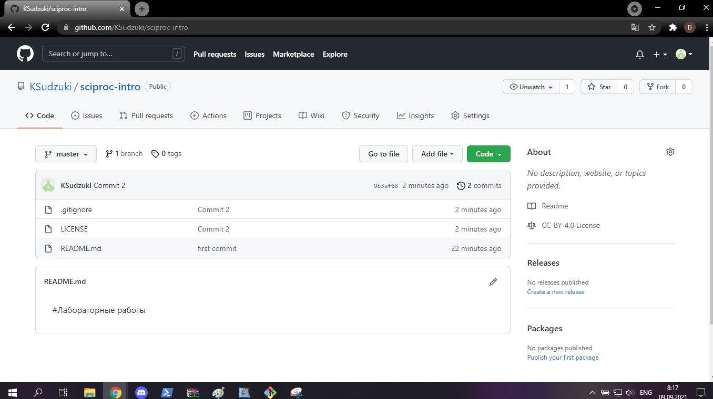

---
# Front matter
lang: ru-RU
title: "Отчет по лабораторной работе №2"
author: "Ким Илья Владиславович"

# Formatting
toc-title: "Содержание"
toc: true # Table of contents
toc_depth: 2
lof: true # List of figures
/*lot: true # List of tables*/
fontsize: 12pt
linestretch: 1.5
papersize: a4paper
documentclass: scrreprt
polyglossia-lang: russian
polyglossia-otherlangs: english
mainfont: PT Serif
romanfont: PT Serif
sansfont: PT Sans
monofont: PT Mono
mainfontoptions: Ligatures=TeX
romanfontoptions: Ligatures=TeX
sansfontoptions: Ligatures=TeX,Scale=MatchLowercase
monofontoptions: Scale=MatchLowercase
indent: true
pdf-engine: lualatex
header-includes:
  - \linepenalty=10 # the penalty added to the badness of each line within a paragraph (no associated penalty node) Increasing the value makes tex try to have fewer lines in the paragraph.
  - \interlinepenalty=0 # value of the penalty (node) added after each line of a paragraph.
  - \hyphenpenalty=50 # the penalty for line breaking at an automatically inserted hyphen
  - \exhyphenpenalty=50 # the penalty for line breaking at an explicit hyphen
  - \binoppenalty=700 # the penalty for breaking a line at a binary operator
  - \relpenalty=500 # the penalty for breaking a line at a relation
  - \clubpenalty=150 # extra penalty for breaking after first line of a paragraph
  - \widowpenalty=150 # extra penalty for breaking before last line of a paragraph
  - \displaywidowpenalty=50 # extra penalty for breaking before last line before a display math
  - \brokenpenalty=100 # extra penalty for page breaking after a hyphenated line
  - \predisplaypenalty=10000 # penalty for breaking before a display
  - \postdisplaypenalty=0 # penalty for breaking after a display
  - \floatingpenalty = 20000 # penalty for splitting an insertion (can only be split footnote in standard LaTeX)
  - \raggedbottom # or \flushbottom
  - \usepackage{float} # keep figures where there are in the text
  - \floatplacement{figure}{H} # keep figures where there are in the text
---

# Цель работы

Изучить идеологию и применение средств контроля версий.

# Задание

–Сделайте отчёт по предыдущей лабораторной работе в формате Markdown.

–В качестве отчёта просьба предоставить отчёты в 3 форматах: pdf, docx и md (в архиве,
поскольку он должен содержать скриншоты, Makefile и т.д.)

# Выполнение лабораторной работы

1. Установка необходимых программ (Chocolatey, git Bash).

2. Настроил систему контроля версий git. 

{ #fig:001 width=70% }

3. Создал учетную запись на github и подключил к ней ssh ключ. 

{ #fig:002 width=70% }

4. Создал структуру каталога лабораторных работ. 

{ #fig:003 width=70% }

5. Создал реозиторий на github и назвал его "sciproc-intro" 

•Рабочий каталог обозначил как “Laboratory”

•В Git Bash перешёл в него командой “cd laboratory”

•Инициализировал системы git командой “git init”

•Создал заготовку для файла README.md

git add README.md

•Сделал первый коммит и выложил его на github

git commit -m "first commit"
	
git remote add origin git@github.com:KSudzuki/sciproc-intro.git 
	
git push -u origin master

{ #fig:004 width=70% }

{ #fig:005 width=70% }

6. Первичная конфигурация 

•Добавил файл лицензии командой wget (Установил ее через Chocolatey)

{ #fig:006 width=70% }

•Посмотрел спписок шаблонов игнорируемых файлов 

{ #fig:007 width=70% }

•Скачал шаблон 

{ #fig:008 width=70% }

•Добавил новые файлы 

git add .

•Выполнил коммит

git commit –a

•Отправил на github

git push

{ #fig:009 width=70% }

{ #fig:0010 width=70% }

7. Конфигурация git-flow 

•Инициализировал git-flow 

git flow init

Префикс для ярлыков установил v.

•Проверил что я на ветке develop (горит зеленым)

git branch

•Создал релиз с версией 1.0.0

git flow release start 1.0.0

•Записал версию:

Echo “1.0.0” >> VERSION

•Добавил в индекс:

git add .
	
git commit –am ‘chore(main): add version’

•Залил релизную ветку в основную ветку

git flow release finish 1.0.0

•Отправил данные на github

git push –all
	
git push –tags

{ #fig:0011 width=70% }

# Ответы на вопросы

1.	Что такое системы контроля версий (VCS) и для решения каких задач они предназначаются? 

Система контроля версий – это система, которая позволяет группе людей работать над одним проектом. Его основное дерево, обычно, находится на локальном или удаленном репозитории, к которому имеют доступ все участники проекта.

2.	Объясните следующие понятия VCS и их отношения: хранилище, commit, история, рабочая копия. 

Хранилище (repository) – место, где хранятся наши файлы на удаленном или локальном VCS.

Commit – команда, которая сохраняет сделанные изменения с внесением комментария, без отправки на репозиторий. 

История – история изменений, которые были сделаны в хранилище.

Рабочая копия – место работы разработчика, до отправки в репозиторий (commit вносит изменения в рабочую копию)

3.	Что представляют собой и чем отличаются централизованные и децентрализованные VCS? Приведите примеры VCS каждого вида. 

Централизованные  –  это VCS с одним основным хранилищем для всего проекта. Каждый пользователь может скопировать себе необходимые ему файлы из этого репозитория, поменять, а затем добавить обратно
      
	  (Примеры: Subversion, CVS, TFS)

Децентрализованные – это VCS, где у каждого пользователя свой вариант(возможно несколько) репозитория. Есть возможность добавлять и забирать изменения из любого хранилища.
       
	   (Примеры: Git, Mercurial, Bazaar)

4.	Опишите действия с VCS при единоличной работе с хранилищем. 

???

5.	Опишите порядок работы с общим хранилищем VCS. 

Общее хранилище VCS служит для хранения текущих(актуальных) версий того, или иного проекта, над которым работает команда. Изначально мы добавляем туда файлы, а далее может брать их, менять, и добавлять новые версии.

6.	Каковы основные задачи, решаемые инструментальным средством git? 

Упрощение работы над групповым и индивидуальным проектом, отслеживание изменений, возврат к предыдущим версиям.

7.	Назовите и дайте краткую характеристику командам git. 

git init – создание основного дерева репозитория

git pull – получение обновлений (изменений) текущего дерева из центрального репозитория

git push – отправка всех произведённых изменений локального дерева в центральный репозиторий

git status – просмотр списка изменённых файлов в текущей директории 

git diff – просмотр текущих изменения

git add .  – добавить все изменённые и/или созданные файлы и/или каталоги 

git add имена_файлов – добавить конкретные изменённые и/или созданные файлы и/или каталоги

git rm имена_файлов – удалить файл и/или каталог из индекса репозитория (при этом файл и/или каталог остаётся в локальной директории)

git commit -am 'Описание коммита'– сохранить все добавленные изменения и все изменённые файлы

git commit – сохранить добавленные изменения с внесением комментария через встроенный редактор

git checkout -b имя_ветки – создание новой ветки, базирующейся на текущей 

git checkout имя_ветки – переключение на некоторую ветку (при переключении на ветку, которой ещё нет в локальном репозитории, она будет создана и связана с удалённой)

git push origin имя_ветки – отправка изменений конкретной ветки в центральный репозиторий 

git merge --no-ff имя_ветки – слияние ветки с текущим деревом 

git branch -d имя_ветки – удаление локальной уже слитой с основным деревом ветки 

git branch -D имя_ветки – принудительное удаление локальной ветки

git push origin :имя_ветки – удаление ветки с центрального репозитория

8.	Приведите примеры использования при работе с локальным и удалённым репозиториями. 

???

9.	Что такое и зачем могут быть нужны ветви (branches)? 

Ветви нужны для того, чтобы люди, работающие над проектом могли вести совместную работу, не мешая друг другу. В ветвях можно тестировать код, а потом, после всех проверок, отправлять обратно в основную(master) ветку.

10.	Как и зачем можно игнорировать некоторые файлы при commit?

Игнорирование используется для того, чтобы исключить не нужные для определенных случаев файлы (ос, языка программирования или среды разработки)

# Выводы

Изучили идеологию и применение средств контроля версий git.